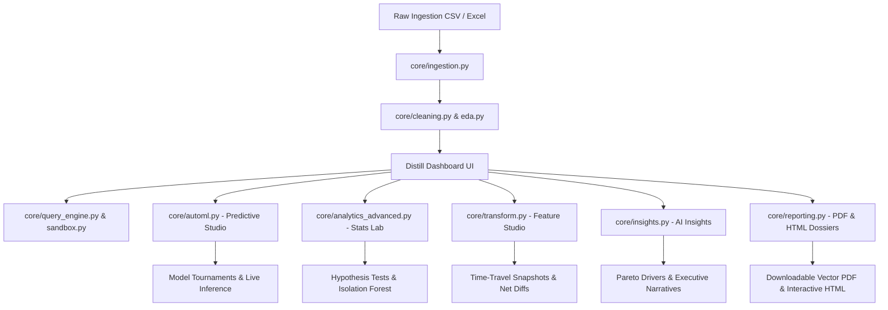

# Distill Data Lab Enterprise

> **Autonomous AI-Driven Data Analysis, Predictive Modeling & Statistical Intelligence Platform**

Distill Data Lab transforms raw, unstructured, or messy business datasets (CSV/Excel) into publication-ready executive insights, automated predictive models, statistical hypothesis assessments, and interactive data engineering pipelines.

---

## Key Capabilities & 5 Advanced Features

### 1. AutoML & Predictive Modeling Studio (`core/automl.py`)
- **Automated Task Inference**: Auto-detects whether the analytical target is a **Classification** or **Regression** problem.
- **Multi-Model Tournament**: Trains and benchmarks multiple diverse algorithms (`RandomForest`, `GradientBoosting`, `LogisticRegression` / `Ridge`, `DecisionTree`, `KNeighbors`) on holdout validation splits.
- **In-Depth Metrics**: Computes Accuracy, F1 (Weighted), Precision, Recall, Confusion Matrix (classification) or R², RMSE, MAE (regression).
- **Driver Attribution**: Extracts ranked feature importances and model coefficients.
- **Interactive Prediction Playground**: Dynamic inference sandbox allowing real-time feature tuning and instant model predictions with confidence estimates.

### 2. Advanced Statistical Testing & Multidimensional Anomalies (`core/analytics_advanced.py`)
- **Inferential Hypothesis Engine**: Runs Student's two-sample t-test, Welch's t-test (unequal variances), Mann-Whitney U test, and multi-group ANOVA / Kruskal-Wallis.
- **Automated Test Recommendation**: Evaluates sample sizes, variance homogeneity (Levene's test), and Gaussian normality to select the optimal statistical test.
- **Significance-Annotated Correlation**: Generates Pearson/Spearman correlation matrices accompanied by exact p-values and significance tiers (`***`, `**`, `*`).
- **Multivariate Isolation Forest**: Uncovers high-dimensional outlier anomalies and unusual cohort clusters beyond simple univariate IQR boundaries.

### 3. Executive Intelligence PDF & HTML Reporting (`core/reporting.py`)
- **Vector PDF Generator**: Compiles executive intelligence dossiers using `reportlab` featuring Distill typography, KPI scorecard grids, attribute schema audits, and strategic recommendations.
- **Interactive HTML Dossier**: Generates standalone, self-contained HTML files embedded with interactive Plotly visual charts, responsive layouts, and print-ready CSS.
- **One-Click Exports**: Direct download triggers integrated seamlessly in both the dashboard sidebar and header action bars.

### 4. Feature Engineering Studio & Time-Travel Versioning (`core/transform.py`)
- **Comprehensive Feature Pipeline**:
  - **Mathematical**: Log1p transform (skew reduction), square root transforms.
  - **Scalers**: Z-Score standardization, Min-Max [0, 1] normalization.
  - **Discretization**: Quantile and uniform interval binning.
  - **Temporal**: Datetime feature decomposition (year, month, day, day of week, weekend indicator).
  - **Interactions**: Multiplicative feature products and ratios.
- **Immutable Time-Travel**: Full undo/redo history stack with snapshot rollbacks.
- **Dataset Diff Engine**: Visual before-and-after audit delta (row changes, column additions/deletions, missing cell eradication, memory impact).

### 5. Autonomous AI Insights & Anomaly Narrative Generator (`core/insights.py`)
- **Heuristic Pattern Discovery**: Automatically uncovers Pareto driver concentrations (80/20 distributions), subgroup performance disparities, data quality risks, and distributional anomalies.
- **Actionable Insight Cards**: Tagged by category (*Key Driver*, *Quality Risk*, *Growth Signal*, *Anomaly Alert*) and prioritized by severity.
- **Conversational Bridge**: Clickable action chips directly populate the Conversational Workspace with targeted analytical queries for rapid drill-downs.
- **Dual-Engine Synthesis**: Operates 100% offline via deterministic statistical synthesis, or online via OpenAI GPT-4o executive narrative briefings.

---

## Architecture Diagram



---

## Test Suite & Verification

The test suite covers unit tests, pipeline tests, security sandboxing, and edge cases across all core modules:

```bash
pytest
```

- **Total Test Cases**: 131 tests
- **Pass Rate**: 100%
- **Coverage**: Ingestion, Cleaning, EDA, Charts, Sandboxing, AutoML, Advanced Analytics, Reporting, Feature Transforms, Autonomous Insights, and End-to-End Workflows.
