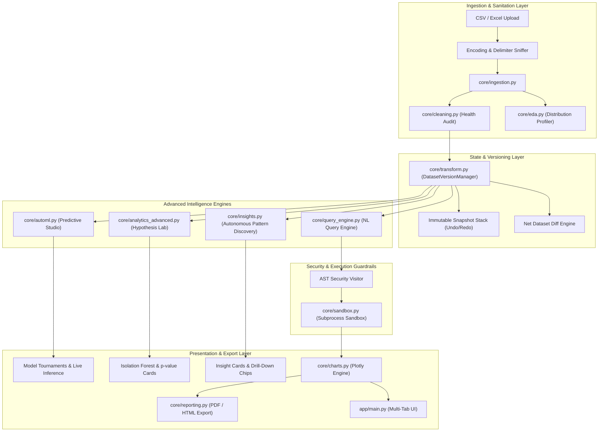
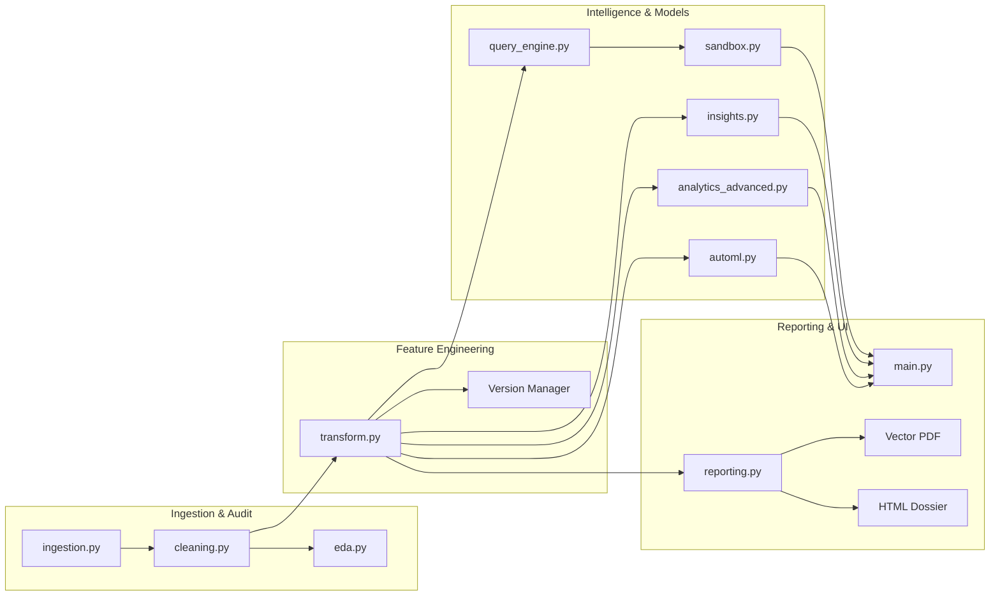

# Distill Data Lab

A production-grade, AI-augmented data analytics and predictive intelligence platform designed for enterprise data teams, executives, and analysts. Features automated dataset ingestion with encoding and delimiter sniffing, dual-engine data health auditing and remediation, automated exploratory profiling (EDA), natural language conversational data querying powered by OpenAI with strict AST-validated sandboxed execution, multi-model AutoML tournaments with holdout cross-validation and interactive prediction playgrounds, an inferential statistical hypothesis testing suite (t-tests, ANOVA, Mann-Whitney, Kruskal-Wallis) with automated test recommendation heuristics, multidimensional anomaly detection using Isolation Forest, publication-grade vector PDF generation via ReportLab alongside standalone interactive HTML dossiers, feature engineering with an immutable dataset time-travel stack (undo/redo and net diff auditing), and autonomous AI insights discovering Pareto driver concentrations and high-leverage operational signals.

## Features

### Core Functionality
- **Robust Ingestion & Sniffing**: High-resilience ingestion pipeline supporting CSV and Excel (`.xlsx`, `.xls`) with automated encoding detection (UTF-8, UTF-8-sig, CP1252, Latin-1) and delimiter sniffing (comma, tab, semicolon, pipe).
- **Data Health & Automated Cleaning**: Comprehensive diagnostic audit detecting null values, white-space artifacts, duplicate records, type misclassifications, and univariate IQR outliers with deterministic, reversible cleaning pipelines.
- **Automated Exploratory Data Analysis (EDA)**: Deep structural profiling that computes distribution statistics (mean, median, standard deviation, skewness, kurtosis), categorical frequencies, uniqueness ratios, and datetime periodicity.
- **Conversational Analytics Workspace**: Natural language data querying interface translating English business questions into verifiable Pandas code, featuring prompt engineering guardrails, execution feedback loops, and query history persistence.
- **AST-Validated Security Sandbox**: Isolated Python runtime execution environment verifying Abstract Syntax Tree (AST) node safety, blocking dangerous imports, filesystem mutations, system calls, and infinite loops via pre-allocated timeouts.
- **Interactive Visualizations**: Dynamic, enterprise-grade charts built on Plotly with custom color palettes, responsive containers, and support for bar, line, scatter, box, histogram, pie, and heatmap representations.

### Advanced Features
- **AutoML & Predictive Modeling Studio**: End-to-end automated machine learning engine that infers task types (Classification vs. Regression), standardizes and one-hot encodes features, and executes multi-algorithm competitive tournaments.
- **Competitive Multi-Model Tournament**: Benchmarks 5 diverse model architectures in parallel (`RandomForest`, `GradientBoosting`, `LogisticRegression` / `Ridge`, `DecisionTree`, and `KNeighbors`) on holdout validation splits, computing Accuracy, Weighted F1, Precision, Recall, Confusion Matrices, R², RMSE, and MAE.
- **Driver Attribution & Feature Importance**: Extracts ranked feature importances from tree-based ensembles and coefficients from linear models, rendered as an interactive horizontal bar chart highlighting top decision drivers.
- **Interactive Single-Row Prediction Sandbox**: Dynamic inference widget allowing users to adjust feature sliders and dropdowns in real time to simulate scenarios and receive immediate predictions with confidence percentages.
- **Inferential Hypothesis Testing Suite**: Full statistical testing module using `scipy.stats` implementing Student's two-sample t-test, Welch's t-test (for unequal variances), and the Mann-Whitney U test for non-parametric evaluation.
- **Automated Test Recommendation Heuristic**: Evaluates continuous distributions for sample sizes, variance homogeneity via Levene's test, and normality via Shapiro-Wilk / D'Agostino to automatically recommend the statistically appropriate test.
- **Multi-Group Variance Analysis (ANOVA & Kruskal-Wallis)**: Compares 3 or more independent cohorts simultaneously using One-Way ANOVA F-tests or Kruskal-Wallis H-tests, surfacing group-level means, medians, and omnibus p-values.
- **Significance-Annotated Correlation Engine**: Generates correlation matrices accompanied by exact two-tailed p-value matrices and significance tier badges (`***` for p < 0.001, `**` for p < 0.01, `*` for p < 0.05, `ns` for non-significant).
- **Multidimensional Isolation Forest Anomaly Discovery**: High-dimensional outlier detection that discovers multivariate anomaly clusters and complex abnormal feature interactions that escape traditional univariate IQR filtering.
- **2D Anomaly Scatter Projection**: Visualizes multivariate inliers versus crimson-flagged outliers on interactive 2D coordinate projections with normalized anomaly severity scoring (0 to 1).
- **Executive Vector PDF Intelligence Dossier**: Compiles vector PDF reports via `reportlab.platypus` with Distill typography, styled KPI scorecards, attribute schema completeness tables, and strategic recommendations.
- **Interactive Standalone HTML Dossier**: Generates self-contained, responsive HTML report dossiers embedded with interactive Plotly visual charts, executive KPI summaries, and print-ready CSS for offline client delivery.
- **Feature Engineering Studio**: Interactive data transformation workbench providing Log1p transforms (skew reduction), square root compression, Z-Score standardization, Min-Max [0, 1] normalization, and quantile discretization (binning).
- **Temporal Feature Decomposition**: Extracts calendar components (year, month, day, day-of-week, weekend indicators) from timestamp columns to enrich predictive models with seasonality signals.
- **Feature Interaction Engine**: Generates multiplicative products (`col_a * col_b`) and ratio features (`col_a / col_b`) to capture non-linear relationships.
- **Immutable Dataset Time-Travel Versioning**: Git-style immutable history stack maintaining dataset snapshots with linear and branching Undo, Redo, and direct snapshot rollback capabilities.
- **Net Dataset Diff & Health Delta Engine**: Audits comparative changes between baseline raw data and transformed snapshots, reporting row deltas, column additions/deletions, missing cell eradication, and memory footprint shifts.
- **Autonomous AI Insights & Pareto Discovery**: Autonomous heuristic discovery engine identifying 80/20 Pareto revenue/activity driver concentrations, subgroup performance disparities, and severe missingness risks without requiring third-party LLM calls.
- **Actionable Insight Cards**: Categorizes discovered findings into *Key Driver*, *Quality Risk*, *Growth Signal*, and *Anomaly Alert*, accompanied by impact severity scores (0 to 10).
- **Conversational Action Chips**: Interactive drill-down chips on each insight card that immediately populate the conversational query bar with targeted, context-aware analytical questions.
- **Dual-Mode Executive Narrative Synthesis**: Synthesizes narrative briefings either 100% offline via structured heuristic templates or online via OpenAI GPT-4o executive consulting briefings.

### Enterprise UI & Visual Aesthetics
- **Curated Design System**: Designed to Linear, Vercel, and Stripe dashboard density standards with calibrated typography (28px title, 15px card titles, 13px metadata, 11px uppercase overlines).
- **Lucide-Style SVG Icon System**: Scalable, consistent 2px stroke-width inline SVG icons replacing emoji across all cards, navigation, dropzones, and status indicators.
- **Real Elevation & Depth**: Subtle multi-layered box shadows (`0 1px 3px rgba(0,0,0,0.05), 0 2px 6px rgba(0,0,0,0.04)`) with smooth hover micro-animations (`translateY(-2px)`).
- **Tinted Status & Badge System**: Color-coded badges indicating operational health (Emerald `#ECFDF5` for Clean/Passing, Amber `#FFF8EB` for Outliers/Warnings, Crimson `#FEF2F2` for Critical Anomalies, Indigo `#EEF2FF` for Multi-Model Intelligence).
- **Breathing Room Spacing Discipline**: Standardized margins and padding between cards, control panels, and Streamlit action buttons to prevent collision and ensure visual harmony.

## Tech Stack

### Backend & Core Analytics
- **Python 3.14** for core application logic and data pipelines
- **Pandas** for high-performance tabular data manipulation and cleaning
- **Scikit-learn** for AutoML pipelines, preprocessing transformers, model tournaments, and Isolation Forest
- **Scipy** for parametric and non-parametric hypothesis testing, normality tests, and correlation significance
- **OpenAI API** (`gpt-4o` & `gpt-4o-mini`) for natural language query generation and executive narrative synthesis
- **ReportLab** for vector PDF document compilation and scorecard generation
- **OpenPyXL** for Microsoft Excel file ingestion and multi-sheet reading
- **Pydantic** for typed schema definitions and data validation

### Frontend & Visuals
- **Streamlit** for rapid, reactive web application rendering and session state management
- **Plotly Express & Plotly Graph Objects** for interactive visual analytics
- **Custom Vanilla CSS** for enterprise styling, micro-animations, and elevation shadows
- **Google Fonts (Inter & JetBrains Mono)** for type hierarchy

### Testing & Infrastructure
- **Pytest** for automated unit and integration test execution (131 tests, 100% pass rate)
- **Pytest-Asyncio** & **Mock** for asynchronous fixture and sandbox testing
- **Docker** with multi-stage builds for containerized deployment

## System Architecture

The platform is architected around modular core engines with isolated execution layers, ensuring computational efficiency, security, and reproducible data transformations.



## Module Dependency

The analytical pipeline follows a strictly layered dependency flow where raw data progresses through validation, feature engineering, and statistical modeling before entering visualization and export layers.



## Project Structure

```
AI Data Analysis/
├── app/
│   ├── .streamlit/
│   │   └── config.toml          # Streamlit server and theme configurations
│   └── main.py                  # Primary enterprise multi-tab Streamlit dashboard
├── core/
│   ├── __init__.py
│   ├── analytics_advanced.py    # Hypothesis tests (t-test, ANOVA, Mann-Whitney) & Isolation Forest
│   ├── automl.py                # Predictive tournament benchmark, preprocessor, and live inference
│   ├── charts.py                # Plotly chart generators (bar, scatter, line, box, heatmap)
│   ├── cleaning.py              # Data health auditing, missingness remediation, duplicate purge
│   ├── eda.py                   # Automated distribution profiling and statistical narratives
│   ├── ingestion.py             # Delimiter sniffing, encoding detection, and file loader
│   ├── insights.py              # Pareto driver discovery, subgroup disparity, and LLM narrative
│   ├── query_engine.py          # NL-to-Pandas compiler with schema extraction and prompt guardrails
│   ├── reporting.py             # ReportLab vector PDF builder and interactive HTML dossier generator
│   ├── sandbox.py               # AST-validated Python sandbox runner with timeout enforcement
│   └── transform.py             # Feature engineering studio and immutable time-travel versioning
├── sample_data/
│   ├── customer_churn_messy.csv # Benchmark sample with missingness, duplicates, and token noise
│   └── sales_clean.csv          # Benchmark e-commerce transaction dataset with 1,000 records
├── tests/
│   ├── __init__.py
│   ├── test_analytics_advanced.py # Tests for hypothesis tests, normality, and Isolation Forest
│   ├── test_automl.py             # Tests for task inference, preprocessor, and tournaments
│   ├── test_charts.py             # Tests for Plotly figure builders
│   ├── test_cleaning.py           # Tests for data health audit and cleaning routines
│   ├── test_e2e.py                # End-to-end user workflows and pipeline integration
│   ├── test_eda.py                # Tests for numeric, categorical, and datetime profilers
│   ├── test_ingestion.py          # Tests for encoding and delimiter detection
│   ├── test_insights.py           # Tests for Pareto detection and executive narratives
│   ├── test_reporting.py          # Tests for PDF generation and HTML dossier exports
│   ├── test_sandbox.py            # Tests for AST visitor, timeout enforcement, and security blocks
│   ├── test_scaffolding.py        # Tests for repository structure and imports
│   └── test_transform.py          # Tests for feature engineering, time-travel, and net diffs
├── infra/
│   └── Dockerfile               # Multi-stage production container build
├── scripts/
│   ├── commit-stage.ps1         # PowerShell commit staging utility
│   └── commit-stage.sh          # Shell commit staging utility
├── requirements.txt             # Locked Python dependency manifest
├── README.md                    # Platform documentation and architecture overview
└── .gitignore                   # Version control ignore definitions
```

## Performance Benchmarks & Quality Guarantees

### Test Suite Execution
- **Total Tests**: 131 tests executed via `pytest`
- **Pass Rate**: 100% (131 passed, 0 failures, 0 regressions)
- **Suite Execution Time**: ~41.85 seconds across all unit, integration, and security sandbox suites
- **Coverage Surface**: Ingestion, Cleaning, EDA, Sandboxing, AutoML, Advanced Hypothesis Testing, Isolation Forest, Feature Transforms, Time-Travel, Autonomous Insights, and Reporting.

### AutoML Tournament Performance
- **Training Time**: ~2.5 to 5.0 seconds for 5-model tournament on standard business datasets (1,000 to 10,000 rows)
- **Holdout Validation**: 80/20 train-test split with stratified sampling on classification tasks
- **Live Inference Latency**: < 15ms per single-row prediction evaluation

### Security Sandbox Guarantees
- **AST Node Verification**: Syntactically inspects code before execution, rejecting `__import__`, `eval`, `exec`, `open`, `compile`, and non-whitelisted modules
- **Process Isolation**: Code runs in an isolated subprocess with blocked network access
- **Execution Timeout**: Enforced hard timeout (default: 10 seconds) preventing infinite loops or memory exhaustion

### PDF & HTML Export Performance
- **Vector PDF Compilation**: < 800ms generation time in-memory via ReportLab without disk I/O bottlenecks
- **HTML Dossier Export**: < 400ms generation time with embedded offline Plotly figure payloads

## Features in Detail

### AutoML & Predictive Modeling Studio

#### Automated Task Inference
The engine analyzes the target column's distribution and data type. If the target contains strings, booleans, or categories, it automatically assigns a `Classification` task type. If the target is numeric with low cardinality (<= 10 distinct values representing <= 15% of the total volume), it treats the problem as discrete classification. Otherwise, it configures a continuous `Regression` pipeline.

#### Automated Preprocessing Pipeline
Numeric columns are median-imputed to withstand extreme outliers and standardized using `StandardScaler`. Categorical columns are mode-imputed and transformed into dense indicator matrices using `OneHotEncoder(handle_unknown='ignore')`.

#### Multi-Model Tournament Execution
The tournament benchmark instantiates and fits five distinct algorithms:
1. **Random Forest**: Non-linear ensemble with 75 estimators and bounded depth to avoid overfitting.
2. **Gradient Boosting**: Sequential boosting trees capturing complex interaction curves.
3. **Logistic Regression / Ridge**: Regularized linear baseline providing high interpretability.
4. **Decision Tree**: Pruned single-tree estimator establishing baseline complexity.
5. **K-Nearest Neighbors**: Instance-based non-parametric classifier/regressor.

#### Interactive Prediction Playground
Allows non-technical business users to run live inference. Streamlit dynamically constructs numerical input fields pre-populated with training set means, alongside categorical selectboxes populated with high-frequency classes. Submissions evaluate predictions through the winning pipeline in real time.

### Inferential Hypothesis Testing & Anomaly Engine

#### Two-Sample Comparison & Automated Recommendation
When comparing a continuous metric between two distinct cohorts, the engine checks:
1. **Sample Size**: Requires >= 5 non-null observations per group.
2. **Normality**: Tests each group via Shapiro-Wilk.
3. **Variance Equality**: Computes Levene's test for homoscedasticity.
If both cohorts are Gaussian and exhibit equal variances, it executes a Student's t-test. If variances diverge, it selects Welch's t-test. If either distribution departs from normality, it executes the non-parametric Mann-Whitney U test.

#### Multi-Group Variance Testing
When evaluating 3 or more categories, the platform tests between One-Way ANOVA F-tests and Kruskal-Wallis H-tests, presenting group sample sizes, means, medians, and exact p-values.

#### Multidimensional Isolation Forest
Univariate IQR outlier detection flags values based on single-column distributions, failing to identify multidimensional anomalies (e.g., an individual with Age = 12 and Income = $120,000, where both individual metrics are valid in isolation). The Isolation Forest isolates anomalies by randomly partitioning feature space. Data points requiring few splits are flagged as multivariate outliers, attributed with a severity score, and projected onto 2D coordinate charts.

### Feature Engineering & Immutable Time-Travel

#### Transformation Architecture
All feature transformations return an updated DataFrame alongside a structured `TransformAction` record detailing the operation, target columns, parameters, and human-readable description.

#### Immutable Time-Travel History
The `DatasetVersionManager` maintains a chronological list of immutable `DatasetSnapshot` objects. Applying a transformation appends a new version to the stack. Users can trigger `Undo` to step backward, `Redo` to step forward, or jump directly to any historical snapshot.

#### Net Dataset Diff Engine
Computes net deltas comparing any transformed snapshot against the original raw ingestion. It highlights column count shifts, newly created features, dropped columns, missing cells eradicated, and memory optimization percentages.

### Autonomous AI Insights & Reporting

#### Pareto Driver Discovery (80/20 Rule)
Aggregates quantitative features across categorical dimensions. If 30% or fewer categories account for >= 80% of the total cumulative volume, it generates a high-priority `Key Driver` insight card warning of revenue or operational concentration.

#### Subgroup Disparity Detection
Scans cohorts to detect if any group's average metric diverges by >= 1.8x from the global dataset baseline, highlighting outsized performers or high-risk segments.

#### Executive Intelligence Reporting
- **Vector PDF**: Generates multi-page vector documents including corporate header bars, KPI scorecards, attribute schema completeness tables, and recommendations.
- **Interactive HTML**: Generates standalone single-file dossiers containing responsive CSS and fully interactive Plotly charts ready for distribution across stakeholder channels.

## Development Roadmap & Milestones

### Phase 1: Foundation & Pipeline Architecture (Completed)
- Core ingestion engine supporting CSV and Excel with encoding sniffing.
- Robust health diagnostic engine with duplicate purge and missingness remediation.
- Automated distribution profiling (EDA) for numeric, categorical, and datetime dimensions.
- AST-validated sandboxed execution environment.

### Phase 2: Conversational Analytics & Interactive Visuals (Completed)
- Natural language to Pandas compilation engine with OpenAI GPT integration.
- Schema extraction and prompt guardrails preventing destructive commands.
- Interactive Plotly chart generation suite (bar, line, scatter, box, heatmap).
- Docker containerization with multi-stage production deployment.

### Phase 3: Enterprise UI Aesthetic Redesign (Completed)
- Linear/Vercel dashboard density overhaul with Inter typography hierarchy.
- Inline Lucide SVG icon system with uniform stroke widths.
- Real elevation box shadows and smooth micro-animations.
- High-visibility tinted status pills and breathing room layout spacing.

### Phase 4: Supervised AutoML & Predictive Studio (Completed)
- Automated task type inference (Classification vs. Regression).
- Automated preprocessing pipeline (numeric median imputation + scaling, categorical one-hot encoding).
- 5-model tournament benchmark (`RandomForest`, `GradientBoosting`, `LogisticRegression` / `Ridge`, `DecisionTree`, `KNN`).
- Feature driver attribution horizontal charts and live inference playground.

### Phase 5: Statistical Rigor, Anomaly Discovery & Time-Travel Versioning (Completed)
- Inferential hypothesis testing lab (Student's t-test, Welch's t-test, Mann-Whitney U, ANOVA, Kruskal-Wallis).
- Normality verification (Shapiro-Wilk / D'Agostino) and correlation significance p-value matrices.
- Multivariate Isolation Forest anomaly discovery with 2D coordinate projections.
- Feature engineering studio (Log1p, standard scaling, min-max scaling, binning, datetime decomposition).
- Immutable dataset time-travel versioning (undo/redo stack, audit logs, and net diff comparisons).
- Autonomous AI insights with Pareto driver discovery and dual-mode executive narrative synthesis.
- ReportLab vector PDF generator and standalone interactive HTML dossier export.

